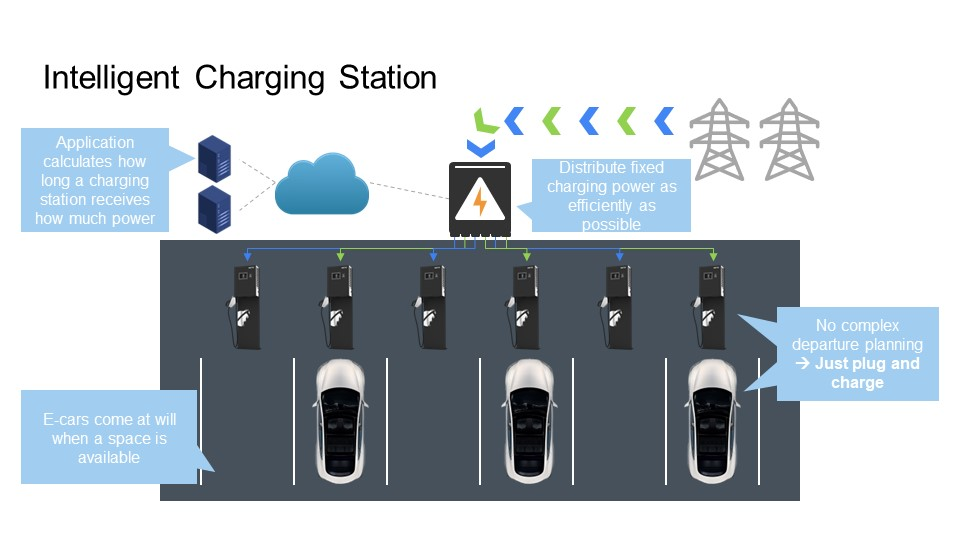
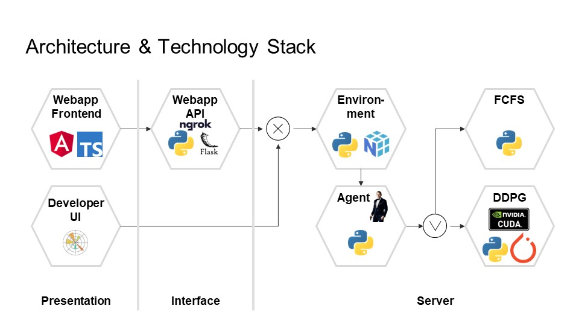
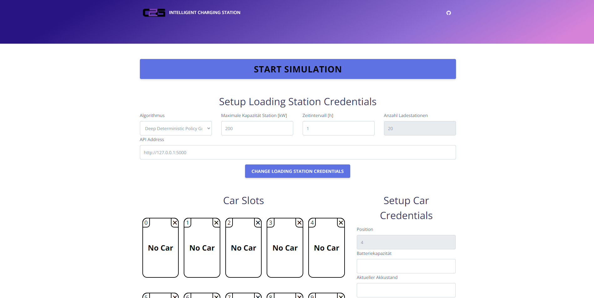
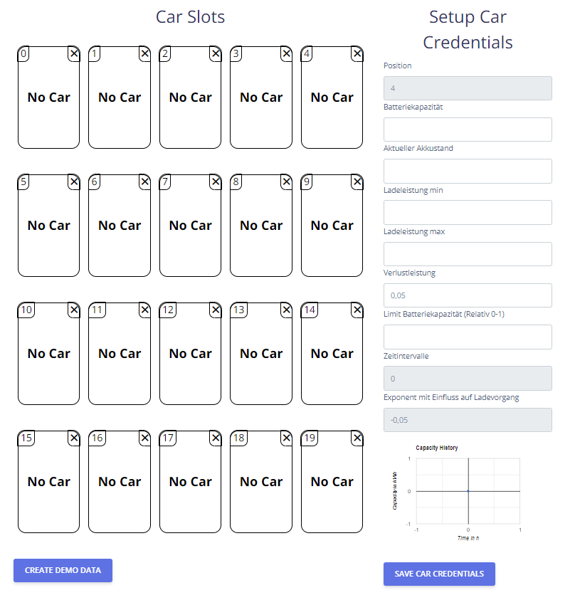
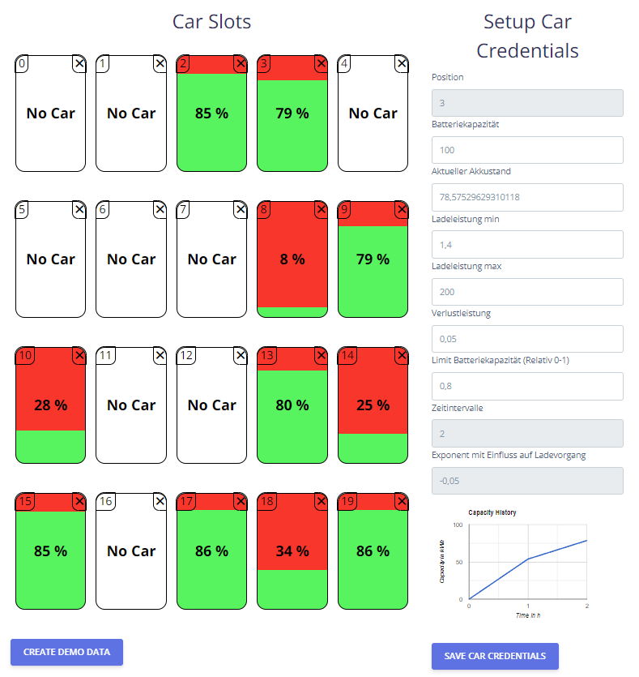

# Intelligent Charging Station

> Please note that the code and contributions in this GitHub repository were created through a collaborative effort by [@Irish-77](https://github.com/Irish-77), [@Ronho](https://github.com/Ronho) and [@FHeidger](https://github.com/FHeidger). All contributors acknowledge that their work is of equal merit and that they each have a deep understanding of the other's contributions.

Intelligent Charging Station (ICS) is a digital twin of a charging station for electric vehicles. The system replicates a virtual parking lot and its charging stations for electric vehicles. However, as in reality, the charging capacity is limited by grid capacities, so not all vehicles can be charged at the same time. ICS starts there and has the goal to distribute the charging power as optimal as possible to all vehicles at charging points.



## Table of contents
1. [Installation](#installation)
    - [Server](#server)
    - [Client](#client)
1. [Description](#description)
    - [Architecture](#architecture)
    - [Client](#client)
1. [Further Reading Material](#further-reading-material)

## Installation

The installation requires several steps and assumes at certain points that other software components are already installed.

First, clone this project.
```sh
git clone https://github.com/C2G-BR/Intelligent-Charging-Station.git
```

### Server

For the server side of the application, [Python](https://www.python.org/) is required. The setup was tested with Python 3.10. Inside the server folder, execute the following command to install all required packages:
```sh
pip install -r requirements.txt
```

#### Training
The following command can then be used to start training the agent.
```sh
python train.py -id run_1 -s 1 --num-episodes 20000 --evaluation-episodes 100 -d --positions 20 --max-power 500
```
The agents are needed to distribute the capacity optimally. There are already pre-trained models under [trained_model](server/model/trained_model/) that are used by default since the training can take up some time. However, feel free to copy the respective files from the newly created `experiment` folder. All configuration options can be called up using the command below.
```sh
python train.py -h
```

#### Evaluation
To compare two or more models against each other, the parameters in [evaluation.py](server/evaluation.py) (lines 109 - 154) can first be adjusted accordingly. With
```sh
python evaluation.py
```
inside the [server](server/) folder, a run of the evaluation is then executed. This creates two files, `small_kw.json` and `video.mp4`, in the [output](server/output/) folder. The file `video.mp4` contains a video of the run. The `small_kw.json` is used in the next step.

#### Animation
Afterwards, a visualization of the changes can be created using [animation.py](server/animation.py). This step requires that [FFmpeg](https://ffmpeg.org/download.html#build-windows) is installed. Then the path for this must be set in line 135 of [animation.py](server/animation.py). After that you can start the animation with
```sh
python animation.py
```
inside the [server](server/) folder to create the file `comparison.mp4` in the [output](server/model/output/) folder.

#### API
Finally, to start the API, the [main.py](server/main.py) must be started with
```sh
python main.py
```

#### ngrok (optional)

Caution this step should only be performed if the risks are known and can be assessed.

The goal of this step is to make a locally launched instance of the API publicly available to enable the separation of the server from the client in real terms. To do this, first create an account at [ngrok](https://ngrok.com/). This is a provider that creates a tunnel between a public IP address and your locally running instance of the API. After creating the account, you need to create an authtoken via ngrok. Use the [documentation of ngrok](https://ngrok.com/docs/getting-started/) for this. Now, it is assumed that the API is started locally. After that, the authtoken and port must be adjusted within the [ngrok.py](server/ngrok.py) (lines 5 and 6). By default, port 5000 is used, but watch the output in your terminal from the API. Then start ngrok with the command below inside [server](server/).
```sh
python ngrok.py
```
You should now be shown a link to your publicly available API. For possible errors watch the output of the terminal. Sometimes you have to do additional steps to activate your ngrok account. Use the link in the frontend from another system as described below.

### Client
Running the frontend requires that the API is already started locally, otherwise some features will not be available. Furthermore, it is required that [Node.js](https://nodejs.org/en) and the node package manager (npm) are installed. This project has been tested with Node.js version v16.19.1 and npm version 8.19.3. Please note that there may be incompatibilities with external libraries in the future. The latter is usually installed with the former. Once everything is installed, the required modules can be installed with
```sh
npm install --force
```
Then the frontend can be started with
```sh
npm start
```
A window with the frontend should now open. Alternatively, the address displayed in the console can be opened.

Please check, on what Address your backend is being hosted (standard: https://127.0.0.1:5000) and whether this IP-Address in set up in the input field of the frontend with the name "api-address". If there is another api-address, replace it with the ip-address of your backend. After saving the credentials, you can use all services of this project.

## Description

### Architecture


The system has a multi-layer structure so that server-side calculations can be separated from the frontend. In the presentation layer, we distinguish between the web app and the developer UI. The latter includes any representations, such as videos and animations, that are exclusively intended for the development and analysis of the models. The webapp is to be understood as the actual link between the human and the overall system and ensures interaction.

Finally, a RESTful API enables the separation to the frontend and provides the necessary endpoints for retrieving and passing data. The server-side application interacts with the API and contains all the necessary components to simulate and optimize it with the help of the agents.


### Client


The frontend consists mainly of three components. At the top are the general settings that can be set using the "CHANGE LOADING STATION CREDENTIALS" button. The car slots contain an image of the vehicles. If you click on one of the slots, a list of the different parameters that make up a slot appears on the right side.



These parameters can be adjusted as required and the new values can be saved using the "SAVE CAR CREDENTIALS" button. Via "CREATE DEMO DATA" sample data can be generated and used. This action can overwrite previous settings. Via the "x" at the parking spaces with vehicles, the vehicle can be removed.

Via the button "START SIMULATION" a step within the simulation is executed and the respective model is used for the agents decision making. After the execution, the loading statuses of the vehicles on the parking spaces are adjusted. By clicking on a vehicle, additional information about the progress of the state of charge can be retrieved or altered.



After a simulation step (standard: one hour), manual adjustments can be made to recreate changes from reality. Alternatively, a connection to a live system via the API would be conceivable.

## Further Reading Material
(Usage only recommended with humor!)
- [🇬🇧 Presentation of the project](docs/ics_presentation_english.pdf)
- [🇩🇪 Presentation of the project](docs/ics_presentation_german.pdf)
- Comparison of FFCS vs. DDPG

    [](https://youtu.be/Gwlv9RnQxOg)


[Go back to table of contents](#table-of-contents)